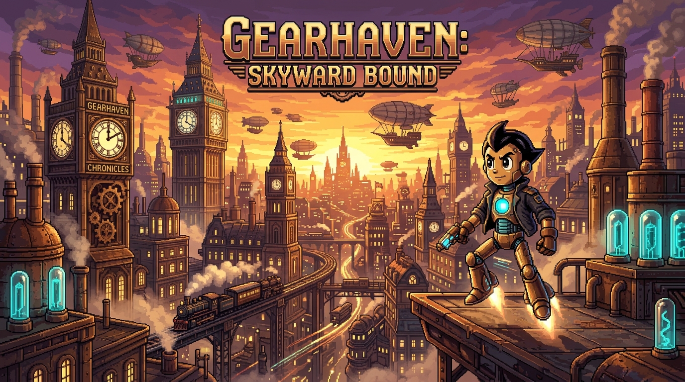
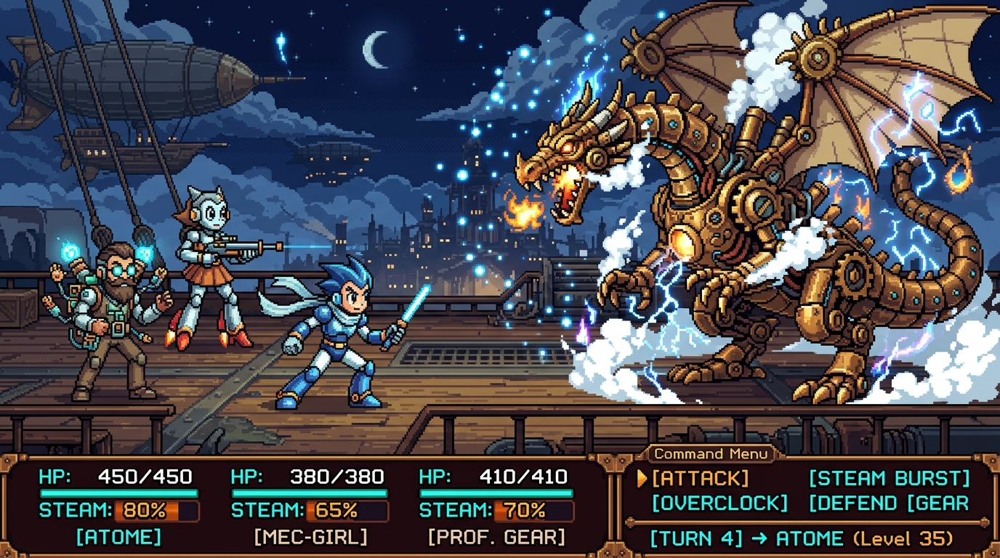
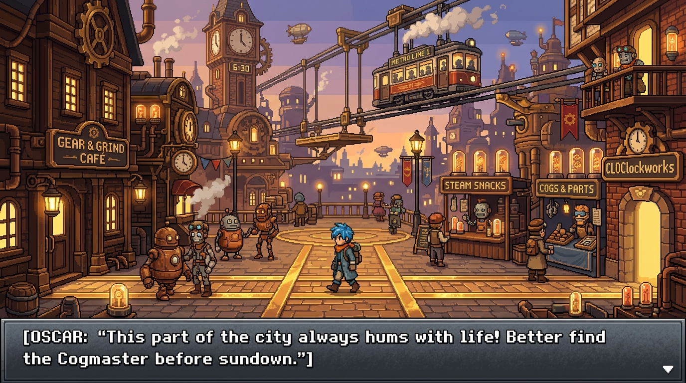
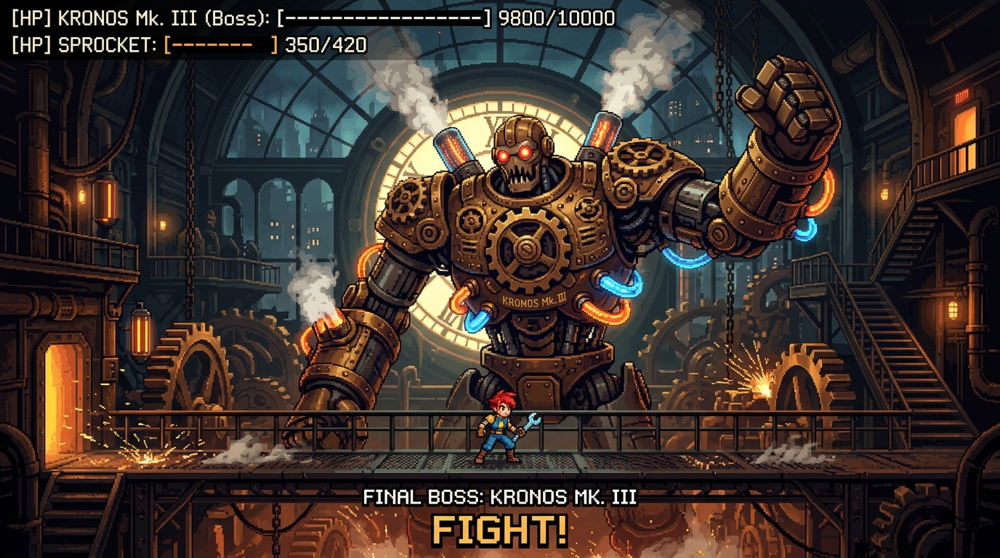
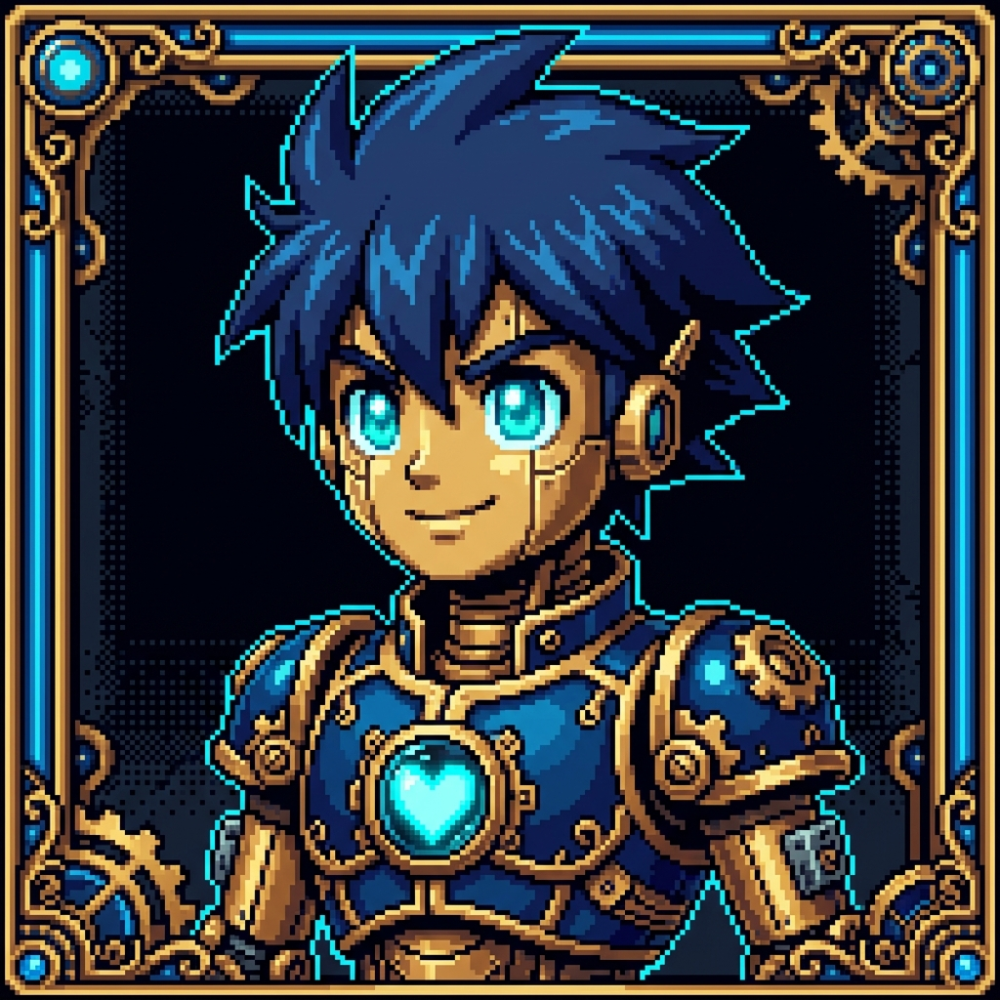
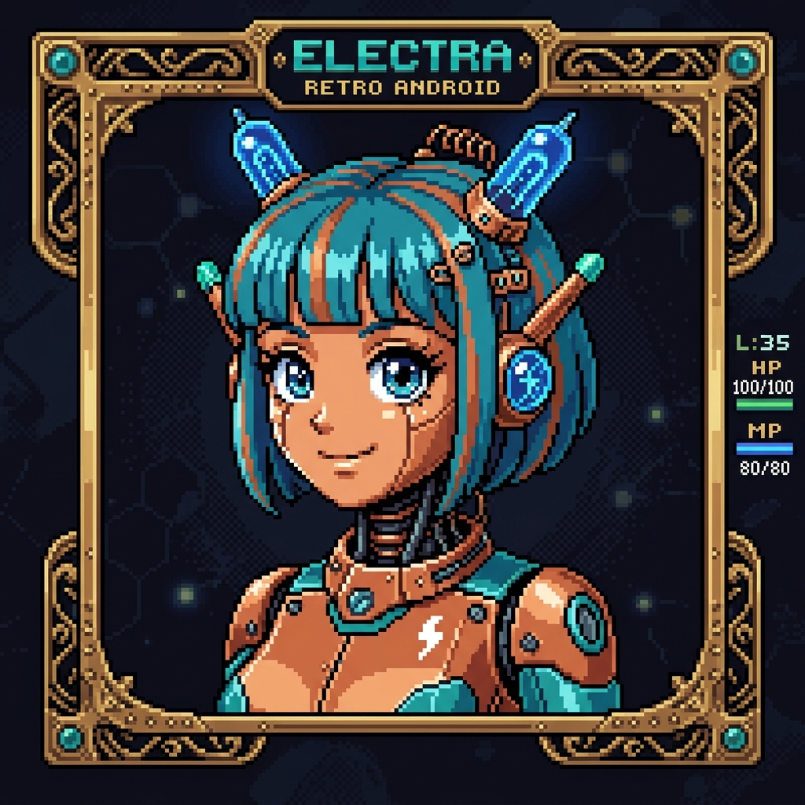
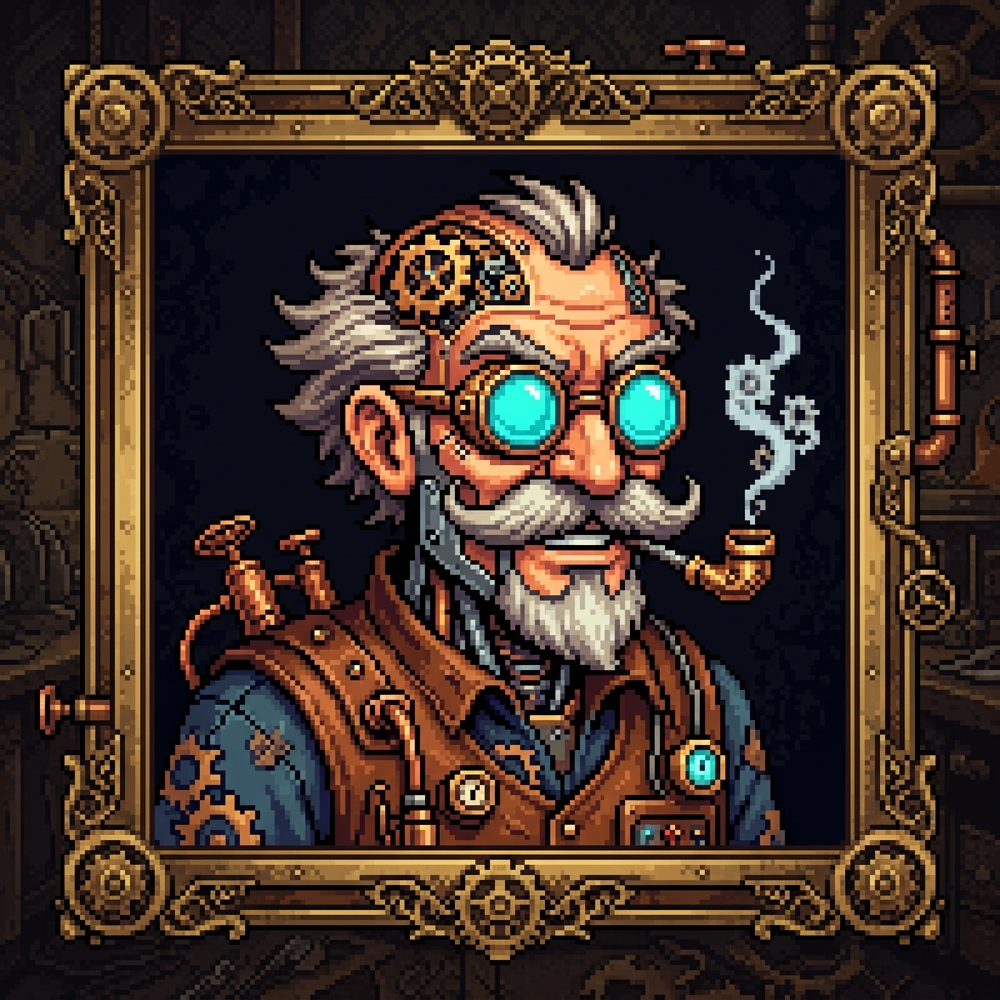
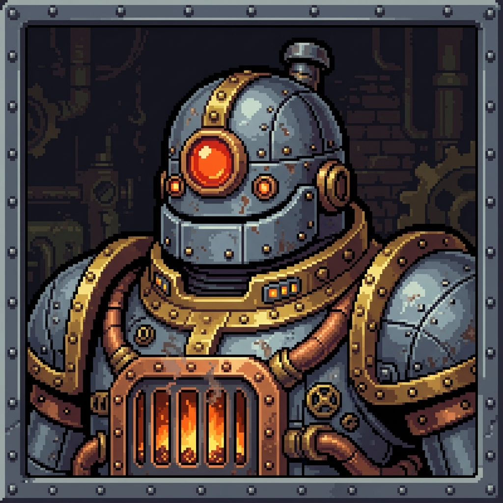

# ⚙️ Gearhaven: Skyward Bound

[](#)
[](#)
[](#)
[](#)
[](LICENSE)

> **"Forged of Brass. Pulsing with Starlight Hearts."**  
> An upcoming 16-bit 2D Action JRPG blending **Steampunk aesthetics** with **Osamu Tezuka retro-futuristic androids**.

---



---

## 📖 Story & Setting

Suspended high above an endless cloud ocean, the seven floating districts of **Gearhaven** drift upon titanic steam thrusters. Powered by the central Prime Clocktower, human inventors and sentient automatons have coexisted in harmony for three centuries.

However, deep beneath the bedrock in the forgotten chasms of District 00, ancient clockwork titans have begun to awaken. As the city's steam pressure balances destabilize, **Sprocket (Model Atom-7)** — a courageous young android fitted with a rare celestial *Starlight Core* — joins forces with an elite party of automatons to prevent the metropolis from plummeting into the abyss.

---

## ✨ Features & Web Experience

- **🎬 Looping Video Preview & HD-2D Key Visuals**:
  - Hero cinematic preview with sound toggle, showcasing animated scene transitions across the city, airship decks, and clocktower foundry.
- **⚔️ Playable In-Browser Combat Simulator**:
  - Full turn-based mini-game: issue commands (`Steam Slash`, `Tesla Arc`, `Overclock`, `Grand Synergy Burst`, `Repair Valve`) against Boss **Kronos Mk. III**.
  - Dynamic floating damage numbers, critical hit shake, stepped HP/Steam gauges, and real-time combat log.
- **🔊 Procedural 16-Bit Web Audio Engine**:
  - Real-time sound synthesis powered by the **Web Audio API** (slashes, tesla zaps, steam hiss, arpeggio heals, explosion rumbles, victory fanfare).
  - Background chiptune adventure soundtrack (enabled by default with interactive audio controls).
- **🤖 Interactive Character Roster**:
  - Inspect attribute meters (Attack Power, Defense Plating, Steam Capacity, Emotion Sync) and signature abilities for *Sprocket*, *Electra*, *Prof. Gear*, and *Baron Boilerplate*.
- **🗺️ Regional World Atlas & Lore Explorer**:
  - Interactive district selector with discovered secrets and danger ratings for *The Grand Clocktower Plaza*, *The Steam-Docks & Sky Flotilla*, *The Pneumatic Foundry*, and *The Sunken Gear Ruins*.
- **📺 Retro CRT Phosphor Scanline Filter**:
  - One-click toggle for vintage arcade monitor scanlines and chromatic glow.
- **⭐ Interactive Steam Wishlist & Newsletter**:
  - Live wishlist clicker with particle feedback and secret skin code unlock (`[BRASS-SPROCKET-2026]`).

---

## 🎨 Visual Assets

| Key Visual | Tactical Combat |
| :---: | :---: |
|  |  |
| **City Exploration** | **Boss Encounter** |
|  |  |

### 🤖 The Party Roster

| Sprocket (Vanguard) | Electra (Tesla Mage) | Prof. Gear (Artificer) | Baron Boilerplate (Tank) |
| :---: | :---: | :---: | :---: |
|  |  |  |  |

---

## 🚀 Quick Start / Cómo Ver el Sitio

¡El proyecto es **100% estático** y **no requiere ningún servidor, instalación ni dependencias**!

1. Clona o descarga este repositorio:
   ```bash
   git clone https://github.com/your-username/gearhaven-rpg-site.git
   ```
2. Abre directamente el archivo **`index.html`** con doble clic o desde cualquier navegador web moderno (*Chrome, Edge, Firefox, Safari*).

---

## 📁 Repository Structure

```
gearhaven-rpg-site/
├── index.html              # Main website structure & semantic layout
├── README.md               # Public documentation & GitHub showcase
├── styles/
│   ├── main.css            # Design system, CSS variables, typography, layout
│   ├── pixel-ui.css        # 9-slice pixel borders, HUD gauges, CRT scanline overlay
│   └── components.css      # Hero, roster, battle simulator, world atlas, modal
├── scripts/
│   ├── audio.js            # Procedural Web Audio API sound synthesizer
│   ├── combat-demo.js      # Playable turn-based combat mini-game engine
│   ├── map-explorer.js     # Regional world atlas & secrets selector
│   └── main.js             # Particle canvas, lightbox, wishlist, audio controls
└── assets/
    ├── images/             # 16-Bit pixel art visuals & character portraits
    └── videos/             # 10-second looping gameplay preview trailer (MP4/WebM)
```

---

## 🛠️ Built With

- **HTML5 & Vanilla CSS3**: Fluid responsive layout with custom pixel HUD styling and zero bulky frameworks.
- **Modular Vanilla JavaScript (ES6+)**: High performance with zero runtime lag.
- **Web Audio API**: Native procedural synthesizer requiring no external MP3 dependencies.
- **HTML5 Canvas**: Floating atmospheric embers, sparks, and steam particles.
- **Typography**: Google Fonts (*Cinzel*, *Press Start 2P*, *Plus Jakarta Sans*, *Silkscreen*).

---

## 🌐 Deploying to GitHub Pages

1. Push this repository to your GitHub account.
2. Go to **Settings** > **Pages**.
3. Under **Build and deployment**, select **Deploy from a branch** -> `main` / `root`.
4. Click **Save** — your official RPG website is live!

---

## 📜 License

Distributed under the **MIT License**. Created by the Gearhaven Game Studios indie team.
